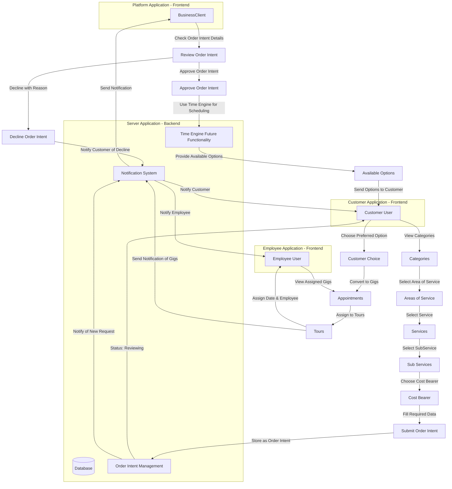

# Architecture of services

## High-Level Overview of the System

### Initial view from Business Owner

```mermai

graph TD
    subgraph Server-App [Server Application - Backend]
        DB[(Database)]
    end

    subgraph Platform-App [Platform Application - Frontend]
        BO[BusinessOwner]
        BC[BusinessClient]
    end

    subgraph Employee-App [Employee Application - Frontend]
        EMP[Employee User]
    end

    subgraph Customer-App [Customer Application - Frontend]
        CUST[Customer User]
    end

    BO -->|Define Categories| DB
    BO -->|Approve/Decline Organization Masters| DB
    BO -->|Invite BusinessClients| BC
    BC -->|Provide Services & Products| DB
    EMP -->|Perform Services| DB
    CUST -->|Request Services| DB

```

### Initial Business Client Flow 

```mermaid
graph TD
    %% Business Client Flow
    subgraph BCFlow [Business Client Flow]
        Email[Invitation Email with Link]
        Email -->|Set Password| BCLogin[Platform Login]
        BCLogin -->|Access Platform| BCPlatform[Platform Dashboard]
        BCPlatform -->|Add Organization Units| OrgUnits[Organization Units]
        OrgUnits --> |Assign OrUnit to Business CLient in DB| DB
        BCPlatform -->|Select Area of Service| AreaService[Area of Service]
        AreaService -->|Choose Existing or Request Approval| OrgMasters[Organization Masters]
        OrgMasters -->|Send Approval Request| DB
        OrgMasters -->|Pending Status Added| DB
        BCPlatform -->|Create & Manage Services| Services[Services]
        Services -->|Approval Request for Names & Fields| DB
        BCPlatform -->|Create SubServices| SubServices[Sub Services]
        SubServices -->|Approval Request for Names & Fields| DB
        BCPlatform -->|Define & Manage Cost Bearers Groups| CostBearers[Cost Bearers Groups]
        CostBearers -->|Manage Individual Cost Bearers| DB
        BCPlatform -->|Manage Customers| Customers[Customer Management]
        Customers -->|Assign to Employees| EMP
    end

### Editing High‐Level B2B Application Relationship Flow without Time Engine

```mermaid

graph TD
%% Restyled B2B Application Relationship Flow (Without Time-Engine Functionality) 
%% Applications
    %% Applications
    subgraph PlatformApp [Platform Application - Frontend]
        BC[BusinessClient]
    end

    subgraph CustomerApp [Customer Application - Frontend]
        CUST[Customer User]
    end

    subgraph EmployeeApp [Employee Application - Frontend]
        EMP[Employee User]
    end

    subgraph ServerApp [Server Application - Backend]
        DB[(Database)]
        OrderIntent[Order Intent Management]
        Notifications[Notification System]
    end

    %% Customer Flow
    CUST -->|View Categories| Category[Categories]
    Category -->|Select Area of Service| AreaService[Areas of Service]
    AreaService -->|Select Service| Service[Services]
    Service -->|Select SubService| SubService[Sub Services]
    SubService -->|Choose Cost Bearer| CostBearer[Cost Bearer]
    CostBearer -->|Fill Required Data| Submit[Submit Order Intent]
    Submit -->|Store as Order Intent| OrderIntent
    OrderIntent -->|Status: Reviewing| CUST

    %% BusinessClient Flow
    OrderIntent -->|Notify of New Request| Notifications
    Notifications -->|Send Notification| BC
    BC -->|Check Order Intent Details| Review[Review Order Intent]
    Review -->|Decline with Reason| Decline[Decline Order Intent]
    Decline -->|Notify Customer of Decline| Notifications
    Review -->|Approve Order Intent| Approve[Approve Order Intent]
    Approve -->|Manually Schedule Gigs| Gigs[Appointments]
    Gigs -->|Assign to Tours| Tours
    Tours -->|Assign Date & Employee| EMP

    %% Employee Flow
    Tours -->|Send Notification of Gigs| Notifications
    Notifications -->|Notify Employee| EMP
    Notifications -->|Notify Customer| CUST
    EMP -->|View Assigned Gigs| Gigs

```

### Restyled B2B Application Relationship Flow (With Time-Engine Functionality)


