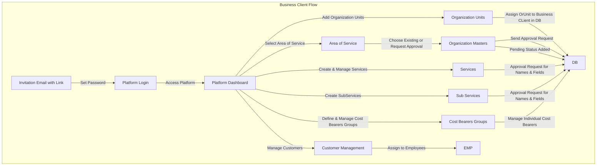

# Architecture of services

## High-Level Overview of the System

### Initial view from Business Owner

```mermai

graph TD
    subgraph Server-App [Server Application - Backend]
        DB[(Database)]
    end

    subgraph Platform-App [Platform Application - Frontend]
        BO[BusinessOwner]
        BC[BusinessClient]
    end

    subgraph Employee-App [Employee Application - Frontend]
        EMP[Employee User]
    end

    subgraph Customer-App [Customer Application - Frontend]
        CUST[Customer User]
    end

    BO -->|Define Categories| DB
    BO -->|Approve/Decline Organization Masters| DB
    BO -->|Invite BusinessClients| BC
    BC -->|Provide Services & Products| DB
    EMP -->|Perform Services| DB
    CUST -->|Request Services| DB

```

### Initial Business Client Flow 


