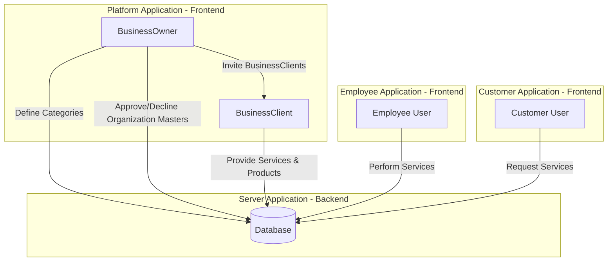
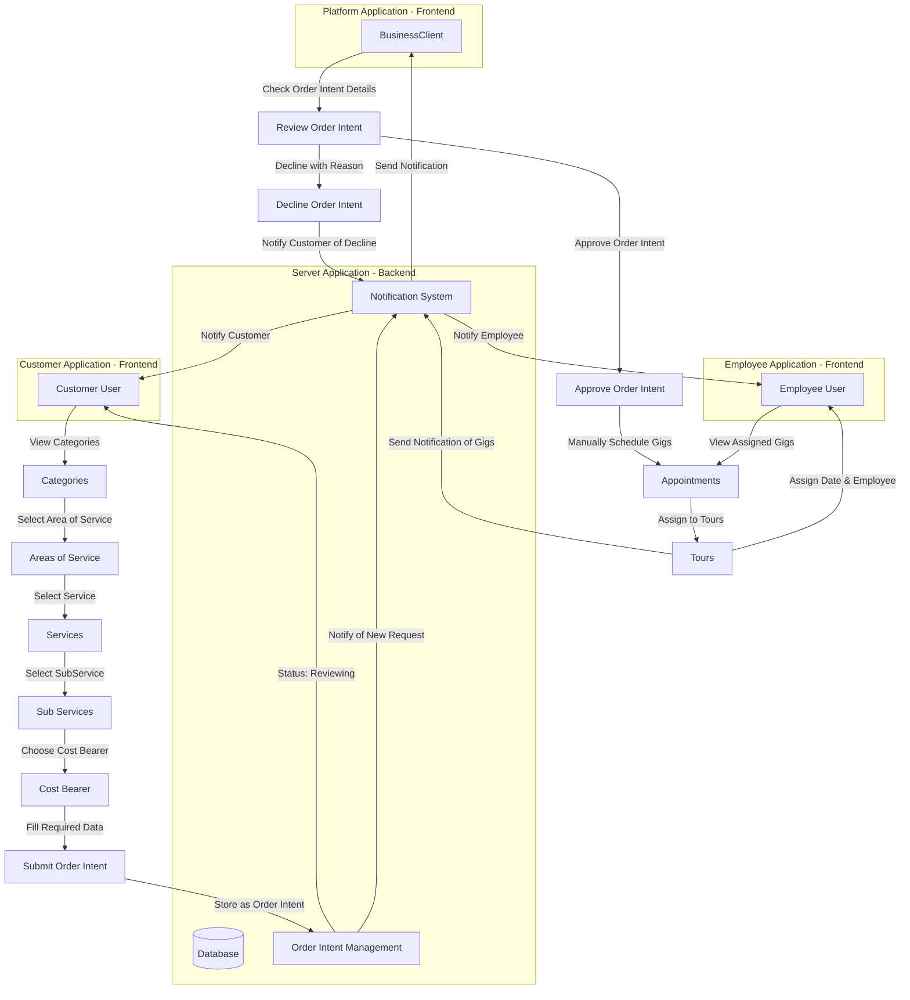

# Architecture of Services

## High-Level Overview of the System

### Initial View from Business Owner

**Description**: This chart provides a high-level view of the system's architecture. It highlights the roles and their primary actions:
- **BusinessOwner** defines categories, approves/declines organization masters, and invites BusinessClients.
- **BusinessClient** provides services and products stored in the backend.
- **Employee** performs assigned services by customers.
- **Customer** requests services, initiating interactions with the backend.

---

### Initial Business Client Flow

**Description**: This chart outlines the initial flow for Business Clients:
- Onboarding starts with an invitation email.
- Business Clients add organization units, select or request approval for areas of service, and manage services and sub-services.
- Cost bearers and customers are managed, and customers are assigned to employees.

---

### High-Level B2B Application Relationship Flow (Without Time-Engine Functionality)

**Description**: This chart shows the B2B application flow without the Time-Engine:
- Customers submit order intents.
- Business Clients manually schedule gigs and assign them to tours.
- Notifications ensure communication between customers, Business Clients, and employees.

---

### High-Level B2B Application Relationship Flow (With Time-Engine Functionality)

**Description**: This chart integrates the Time-Engine functionality for automated scheduling:
- Time-Engine provides scheduling options to customers.
- Customers select their preferred option, and gigs are automatically scheduled and assigned.
- Notifications ensure smooth communication.

